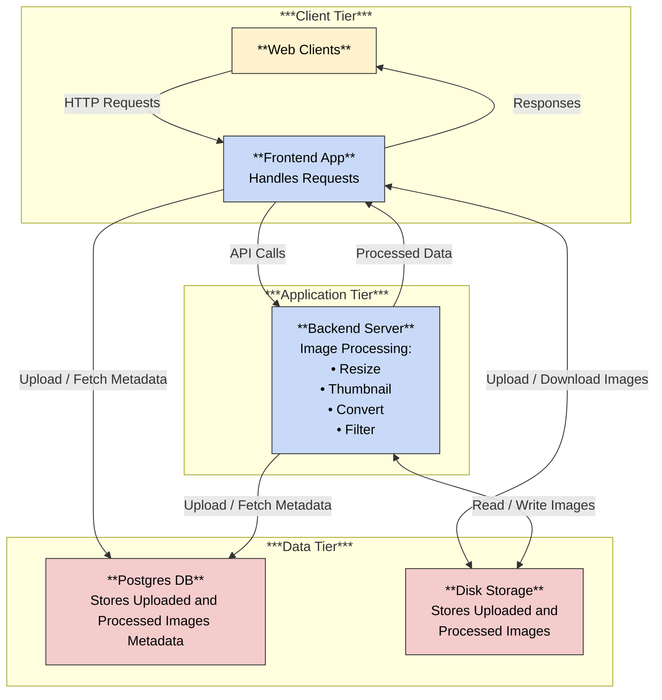

# Image Processing Service

A multi-tier application for uploading, processing, and storing images with metadata.

## Architecture

- **Client Tier**: Web clients interact with Frontend App (handles requests, no UI).
- **Application Tier**: Backend Server processes images (resize, thumbnail, convert, filter).
- **Data Tier**: Postgres DB (image metadata); Disk Storage (uploaded/processed images).

